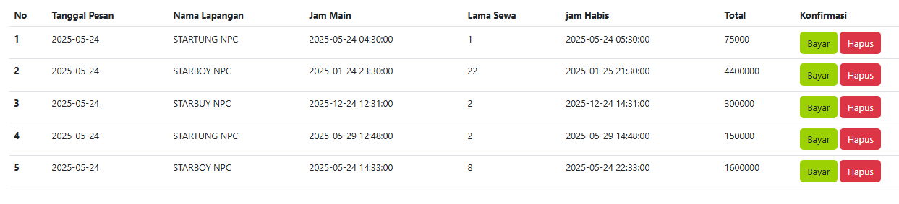

Harga : Murah/Normal/Mahal
Tanggal : Dulu/Sekarang/Nanti
Waktu : Pagi/Siang/Malam
Lama main : Sebentar/Standar/Lama

Tabel Pengujian Kombinasi Nilai Input 
## Tabel Pengujian Kombinasi Nilai Input

| **Test Case** | **Harga** | **Tanggal** | **Waktu** | **Lama main** | **Dokumentasi Hasil Uji** |
|---------------|-----------|-------------|-----------|----------------|----------------------------|
| B01           | Murah     | Sekarang    | Pagi      | Sebentar       | 

 |
| B02           | Mahal     | Dulu        | Malam     | Lama           |                            |
| B03           | Normal    | Nanti       | Siang     | Standar        |                            |
| B04           | Murah     | Nanti       | Siang     | Standar        |                            |
| B05           | Mahal     | Sekarang    | Siang     | Sebentar       |                            |

| **Test Case** | **Harga** | **Tanggal** | **Waktu** | **Lama main** | **Dokumentasi Hasil Uji**                              |
| ------------- | --------- | ----------- | --------- | ------------- | ------------------------------------------------------ |
| B01           | Murah     | Sekarang    | Pagi      | Sebentar      |                                                        |
| B02           | Mahal     | Dulu        | Malam     | Lama          |                                                        |
| B03           | Normal    | Nanti       | Siang     | Standar       |                                                        |
| B04           | Murah     | Nanti       | Siang     | Standar       |                                                        |
| B05           | Mahal     | Sekarang    | Siang     | Sebentar      |  |

