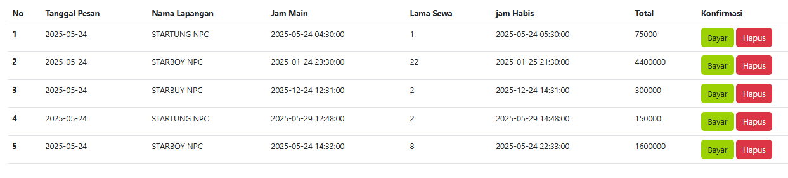

Tabel Pengujian Kombinasi Nilai Input 
| **Test Case** | **Harga** | **Tanggal** | **Waktu** | **Lama main** |                               
| ------------- | --------- | ----------- | --------- | ------------- | 
| B01           | Murah     | Sekarang    | Pagi      | Sebentar      |                                                        
| B02           | Mahal     | Dulu        | Malam     | Lama          |                                                        
| B03           | Normal    | Nanti       | Siang     | Standar       |                                                        
| B04           | Murah     | Nanti       | Siang     | Standar       |                                                        
| B05           | Mahal     | Sekarang    | Siang     | Sebentar      | 
1. Harga : Murah/Normal/Mahal
2. Tanggal : Dulu/Sekarang/Nanti
3. Waktu : Pagi/Siang/Malam
4. Lama main : Sebentar/Standar/Lama

**Dokumentasi Hasil Uji**  

