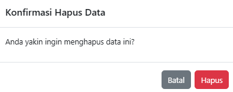
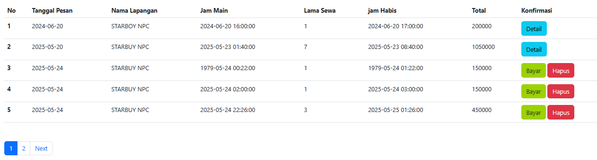

# Laporan Pengujian Fitur Pemesanan Lapangan

---

## 1. Menguji Fungsionalitas Dasar

| **Test Case** | **Fitur Dasar** | **Deskripsi**                | **Dokumentasi**         |
|---------------|------------------|-------------------------------|--------------------------|
| E01           | Pemesanan        | User memesan sewa lapangan   |      |

### Hasil Uji Fitur Pemesanan

| **Hasil Uji**                                         | **Checklist** | **Deskripsi**                                            | **Dokumentasi**                                  |
|--------------------------------------------------------|----------------|-----------------------------------------------------------|--------------------------------------------------|
| UI ditampilkan dengan benar                            | ✅              | UI ditampilkan sesuai dengan fitur pemesanan              |                              |
| Mencoba melakukan pemesanan                            | ✅              | Fungsional fitur pesan berjalan dengan baik               |          |
| Melihat pesanan apakah sudah terjadi                   | ✅              | Pesanan bisa dilihat di bagian pembayaran                 |                              |
| Mencoba mengedit pemesanan                             | ❌              | Tidak tersedia fitur edit pesanan                         | -                                                |
| Melihat pembaruan pesanan apakah sudah terjadi         | ❌              | Tidak tersedia fitur edit pesanan                         | -                                                |
| Mencoba menghapus pemesanan                            | ✅              | Pesanan bisa dihapus                                      |                              |
| Melihat penghapusan pesanan apakah sudah terjadi       | ✅              | Pesanan sudah tidak ada lagi di bagian pembayaran         |                              |

> **Catatan:**  
> Fitur edit pesanan **belum tersedia**, sehingga semua skenario terkait pembaruan tidak dapat diuji dan ditandai sebagai **tidak berhasil (❌)**. Penghapusan dan pemesanan berjalan **sesuai ekspektasi**.

---

## 2. Pengujian Batasan dan Skenario Tidak Terduga

| **Kode** | **Fitur Dasar** | **Deskripsi**                   | **Dokumentasi**         |
|----------|------------------|----------------------------------|--------------------------|
| F01      | Pemesanan        | User memesan sewa lapangan       |      |

### Hasil Pengujian

| **Hasil Uji**                             | **Checklist** | **Deskripsi**                                                                                                                                   | **Dokumentasi**                                                                                   |
|------------------------------------------|---------------|--------------------------------------------------------------------------------------------------------------------------------------------------|---------------------------------------------------------------------------------------------------|
| Memesan di waktu yang sudah terlewat     | ✅             | Pesanan dapat diterima ke tahap pembayaran padahal seharusnya tidak masuk akal. Sistem seharusnya menolak pesanan semacam ini.                  |                                |
| Memesan dengan durasi 01:59              | ✅             | Harga yang tercantum adalah harga normal untuk 1 jam, bukan hampir 2 jam. Seharusnya sistem menghitung harga secara proporsional per menit.     |                                                                              |

---

## 3. Menguji Performa dan Stabilitas

| **Test Case** | **Fitur Dasar** | **Deskripsi**                   | **Dokumentasi**         |
|---------------|------------------|----------------------------------|--------------------------|
| F01           | Pemesanan        | User memesan sewa lapangan       |      |

### Hasil Pengujian

| **Hasil Uji**                      | **Checklist** | **Deskripsi**                                                               | **Dokumentasi**         |
|-----------------------------------|---------------|------------------------------------------------------------------------------|--------------------------|
| Memesan 10 pesanan penyewaan      | ✅             | Sistem berjalan normal karena masih dalam lingkungan pengujian lokal (localhost) |      |

---

## 4. Kegunaan dan Pengalaman Pengguna

| **Test Case** | **Fitur Dasar** | **Deskripsi**                   | **Dokumentasi**         |
|---------------|------------------|----------------------------------|--------------------------|
| G01           | Pemesanan        | User memesan sewa lapangan       |      |

### Hasil Pengujian

| **Hasil Uji**                                                                 | **Checklist** | **Deskripsi**                                                                                      | **Dokumentasi**         |
|--------------------------------------------------------------------------------|---------------|-----------------------------------------------------------------------------------------------------|--------------------------|
| Tombol "Today" berada di posisi yang mudah terpencet secara tidak sengaja      | ✅             | Sering terjadi missklik akibat penempatan tombol "Today" yang terlalu dekat dengan area klik utama |      |
| Pemilihan durasi main menggunakan waktu (jam/menit) terlalu rumit              | ✅             | Membutuhkan banyak interaksi seperti scroll dan klik; sebaiknya cukup input durasi dalam menit     |      |
