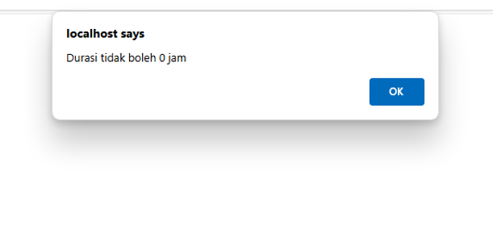

## Test Case C01 - Menambahkan Logika Durasi Lama Main Tidak Boleh 0

### Detail Test Case

| Test case | Fitur Baru | Deskripsi | Dokumentasi |
|-----------|------------|-----------|-------------|
| C01       | Menambahkan logika Durasi Lama main tidak boleh 0 | Penambahan logika ketika menginput pesan untuk lama main tidak boleh 00:00, jika dilakukan maka akan ada notifikasi “durasi tidak boleh 0 jam” |  |

### Hasil Pengujian

| Hasil Uji                           | Checklist | Deskripsi                                      |
|-------------------------------------|-----------|------------------------------------------------|
| Menjalankan kembali Test Case       | ✅         | Mencoba fungsionalitas Testcase                |
| Test Case lulus                     | ✅         | Fitur ditambahkan sesuai keinginan             |
| Uji Coba Fitur Baru                 | ✅         | Fitur berjalan dengan baik                     |
| Menyebabkan masalah                 | ❌         | Berjalan tidak ada menyebabkan masalah         |
