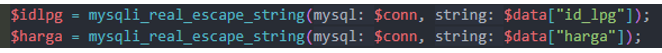

## Test Case C01 - Menambahkan Logika Durasi Lama Main Tidak Boleh 0

### Detail Test Case

| Test case | Fitur Baru | Deskripsi | Dokumentasi |
|-----------|------------|-----------|-------------|
| C01       | Menambahkan logika Durasi Lama main tidak boleh 0 | Penambahan logika ketika menginput pesan untuk lama main tidak boleh 00:00, jika dilakukan maka akan ada notifikasi “durasi tidak boleh 0 jam” |  |

### Hasil Pengujian

| Hasil Uji                           | Checklist | Deskripsi                                      |
|-------------------------------------|-----------|------------------------------------------------|
| Menjalankan kembali Test Case       | ✅         | Mencoba fungsionalitas Testcase                |
| Test Case lulus                     | ✅         | Fitur ditambahkan sesuai keinginan             |
| Uji Coba Fitur Baru                 | ✅         | Fitur berjalan dengan baik                     |
| Menyebabkan masalah                 | ❌         | Berjalan tidak ada menyebabkan masalah         |

## Test Case D01 - Pencegahan Gangguan SQL Injector

### Detail Test Case

| Test case | Memperbaiki Gangguan | Deskripsi | Dokumentasi |
|-----------|----------------------|-----------|-------------|
| D01       | Pencegahan gangguan SQL injector | Penambahan logika ketika disisipkan script berbahaya | 
| 

### Hasil Pengujian

| Hasil Uji                           | Checklist | Deskripsi                                      |
|-------------------------------------|-----------|------------------------------------------------|
| Menjalankan kembali Test Case       | ✅         | Mencoba fungsionalitas Testcase                |
| Test Case lulus                     | ✅         | Fitur mendeteksi gangguan                      |
| Uji Dengan Bug                      | ✅         | Bug berhasil dideteksi dan tidak diterima sistem |
| Menyebabkan masalah                 | ❌         | Berjalan tidak ada menyebabkan masalah         |

## Test Case D01 - Memindahkan Folder Function.php ke Folder Lain

### Detail Test Case

| Test case | Infrastruktur Baru | Deskripsi | Dokumentasi |
|-----------|--------------------|-----------|-------------|
| D01       | Memindahkan folder `Function.php` ke folder lain | Melakukan test untuk melihat bagaimana fleksibilitas source code | ![[Notifikasi]](regresion3.png) |
### Hasil Pengujian

| Hasil Uji                           | Checklist | Deskripsi                                      |
|-------------------------------------|-----------|------------------------------------------------|
| Menjalankan kembali Test Case       | ✅         | Mencoba fungsionalitas Testcase                |
| Test Case lulus                     | ✅         | Sistem masih berjalan dengan baik              |
| Uji Coba server Baru                | ✅         | Tidak jauh berbeda dengan performa sebelumnya  |
| Menyebabkan masalah                 | ❌         | Berjalan tidak ada menyebabkan masalah         |

