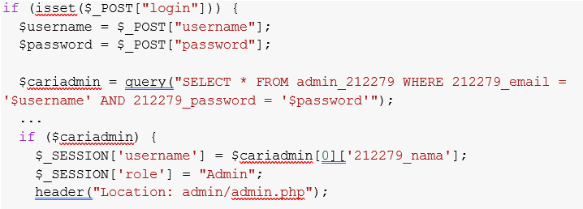
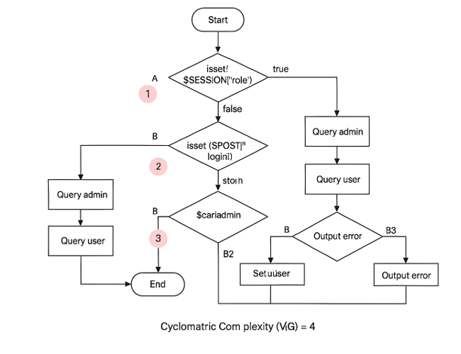

| Bagian | Path | Code | Jalur |
|--------|------|------|-------|
| A | Sudah Login sebagai Admin |  | 1. Cek `isset($_SESSION["role"])` 2. Jika `true`, cek `role == "Admin"` 3. Jika `true`, redirect ke `admin/home.php` |
| A | Sudah Login sebagai User |  | 1. Cek `isset($_SESSION["role"])` 2. Jika `true`, cek `role == "Admin"` 3. Jika `false`, redirect ke `user/lapangan.php` |
| B1 | Login Berhasil sebagai Admin |  | 1. Cek `isset($_POST["login"])` 2. Query ke tabel admin 3. Jika `$cariadmin == true`, set session 7. Redirect ke `admin/admin.php` |
| B2 | Login Berhasil sebagai User |  | 1. Cek `isset($_POST["login"])` 2. Query admin → kosong 3. Query user → `$cariuser == true` 7. Set session dan redirect ke `user/lapangan.php` |
| B3 | Login Gagal |  | 1. Cek `isset($_POST["login"])` 2. Query admin dan user keduanya gagal 3. Munculkan pesan error & refresh halaman |

Cyclomatic Complexity (V(G))
•	Jumlah simpul (Node) = 7 (cek session, cek role, login check, query admin, query user, cek hasil, error)
•	Jumlah edge = 9 (jalur cabang dan arah)
•	Jumlah komponen terhubung = 1
Rumus: V(G) = E - N + 2P
V(G) = 9 - 7 + 2(1) = 4
Hasil: Ada 4 jalur independen yang perlu diuji (A1, A2, B1, B2, B3 — B3 bisa dikelompokkan sebagai alternatif ke-4).

Kesimpulan
Pengujian Basic Path Testing pada kode kamu bisa dibagi ke 5 jalur eksekusi utama:
| Jalur | Kondisi           | Hasil Diharapkan                     |
|-------|-------------------|--------------------------------------|
| A1    | Session = Admin   | Redirect ke `admin/home.php`         |
| A2    | Session = User    | Redirect ke `user/lapangan.php`      |
| B1    | Login valid admin | Redirect ke `admin/admin.php`        |
| B2    | Login valid user  | Redirect ke `user/lapangan.php`      |
| B3    | Login gagal       | Tampilkan pesan error & refresh page |

