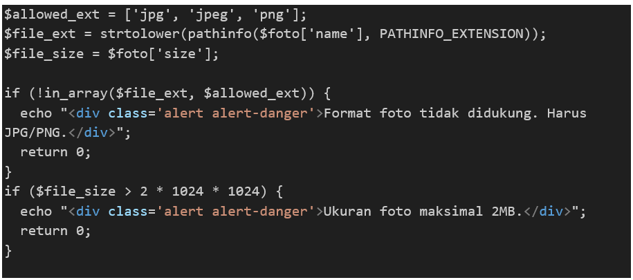

| Screenshot | Deskripsi Code |
|------------|----------------|
|  | **Tidak ada validasi dan sanitasi input secara eksplisit** - Input dari `$_POST` langsung masuk ke fungsi `daftar()`. - Jika `daftar()` tidak melakukan sanitasi, rawan **SQL Injection** atau **XSS**. - Contoh: `nama`, `email`, `hp` bisa saja mengandung script/karakter berbahaya. |
|  | **Tidak ada pengecekan apakah email atau nomor HP sudah terdaftar sebelumnya** - User bisa mendaftar berkali-kali dengan email/HP yang sama. - Tidak ada feedback jika email sudah digunakan. 💡 *Seharusnya ada kode seperti:* `$cek = mysqli_query($conn, "SELECT * FROM users WHERE email = '$email' OR hp = '$hp'");` `if (mysqli_num_rows($cek) > 0) { echo "Email atau No HP sudah terdaftar."; return 0; }` |
|  | **Upload foto tanpa validasi tipe dan ukuran file** - Input `type="file"` belum divalidasi format dan ukuran. - Risiko upload file berbahaya jika tidak dicek. 💡 *Saran kode validasi:* `$allowed_ext = ['jpg', 'jpeg', 'png'];` `$file_ext = strtolower(pathinfo($foto['name'], PATHINFO_EXTENSION));` `$file_size = $foto['size'];` Validasi: cek format dan ukuran maksimal 2MB. |
|  | **Penggunaan `meta http-equiv='refresh'` untuk redirect** - Redirect ini fungsional tapi **kurang ideal** untuk user experience. 💡 *Lebih baik gunakan:* `header("Location: ../login.php");` setelah kontrol output. |
|  | **Penggunaan `id="exampleInputPassword1"` untuk banyak elemen input** - Semua input punya `id` yang sama padahal harus **unik**. - Bisa ganggu styling dan fungsi JavaScript. |
|  | **Tidak ada feedback jika pendaftaran gagal** - Jika `daftar($_POST)` gagal, tidak ada pesan error. - User jadi tidak tahu penyebab gagalnya pendaftaran. |
