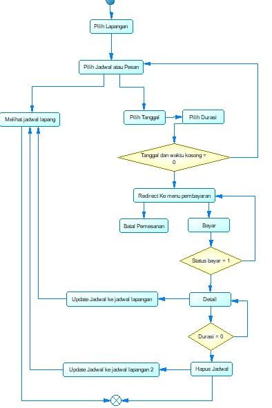

# Alur Pemesanan Lapangan

Berikut adalah flowchart proses pemesanan lapangan:

Flowchart di atas menjelaskan alur sistem pemesanan lapangan secara terstruktur. Berikut ini adalah penjabaran dari masing-masing komponen yang terdapat dalam flowchart:

## Tabel Komponen Alur Pemesanan

| **Komponen**                        | **Definisi**                                      | **Penggunaan**                                   | **Deskripsi**                                                                 |
|------------------------------------|---------------------------------------------------|--------------------------------------------------|--------------------------------------------------------------------------------|
| Pilih Lapangan                     | Menampilkan daftar lapangan                      | Langkah awal pemesanan atau pengecekan jadwal    | Pengguna memilih lapangan yang ingin digunakan.                               |
| Pilih Jadwal atau Pesan            | Opsi untuk melihat jadwal atau melakukan pemesanan| Menu navigasi                                   | Pengguna memilih apakah ingin melihat jadwal atau langsung memesan.          |
| Melihat Jadwal Lapang             | Menampilkan informasi jadwal lapangan            | Informasi ketersediaan lapangan                 | Pengguna dapat melihat jadwal yang tersedia pada lapangan yang dipilih.       |
| Pilih Tanggal                      | Tanggal pemesanan                                | Input dari pengguna                             | Pengguna memilih tanggal untuk memesan lapangan.                              |
| Pilih Durasi                       | Lama waktu penggunaan lapangan                   | Input dari pengguna                             | Pengguna memilih berapa lama akan menyewa lapangan.                           |
| Tanggal dan Waktu Kosong = 0      | Kondisi pengecekan apakah waktu tersedia         | Validasi input                                  | Jika tidak tersedia, proses berhenti atau kembali ke pilihan.                |
| Redirect ke Menu Pembayaran       | Navigasi ke halaman pembayaran                   | Setelah validasi waktu berhasil                 | Pengguna diarahkan ke halaman pembayaran jika tanggal dan waktu tersedia.     |
| Batal Pemesanan                    | Opsi untuk membatalkan pemesanan                 | Dapat dilakukan sebelum pembayaran              | Pengguna dapat membatalkan proses jika belum ingin melanjutkan ke pembayaran.|
| Bayar                              | Melakukan pembayaran                             | Proses pembayaran setelah pemesanan             | Pengguna melakukan pembayaran atas pemesanan yang telah dipilih.              |
| Status Bayar = 1                   | Kondisi pembayaran berhasil                      | Validasi pembayaran                             | Memeriksa apakah pembayaran berhasil. Jika tidak, kembali ke proses sebelumnya.|
| Detail                             | Informasi detail jadwal                          | Ditampilkan setelah pembayaran                  | Menampilkan detail pemesanan lapangan setelah pembayaran berhasil.            |
| Durasi = 0                         | Pengecekan waktu penggunaan telah habis          | Validasi penggunaan                             | Jika durasi pemesanan sudah selesai, akan dilanjutkan ke proses penghapusan. |
| Update Jadwal ke Jadwal Lapangan  | Menambahkan jadwal pemesanan ke daftar jadwal    | Setelah pembayaran sukses                       | Jadwal baru dimasukkan ke sistem jadwal lapangan.                             |
| Update Jadwal ke Jadwal Lapangan 2| Memperbarui jadwal jika terjadi perubahan        | Setelah penggunaan selesai atau pembatalan      | Jadwal diupdate kembali untuk mengosongkan slot yang sudah selesai dipakai.  |
| Hapus Jadwal                       | Menghapus jadwal dari sistem jadwal              | Jika durasi = 0                                 | Menghapus pemesanan dari sistem setelah waktu penggunaan selesai.             |

